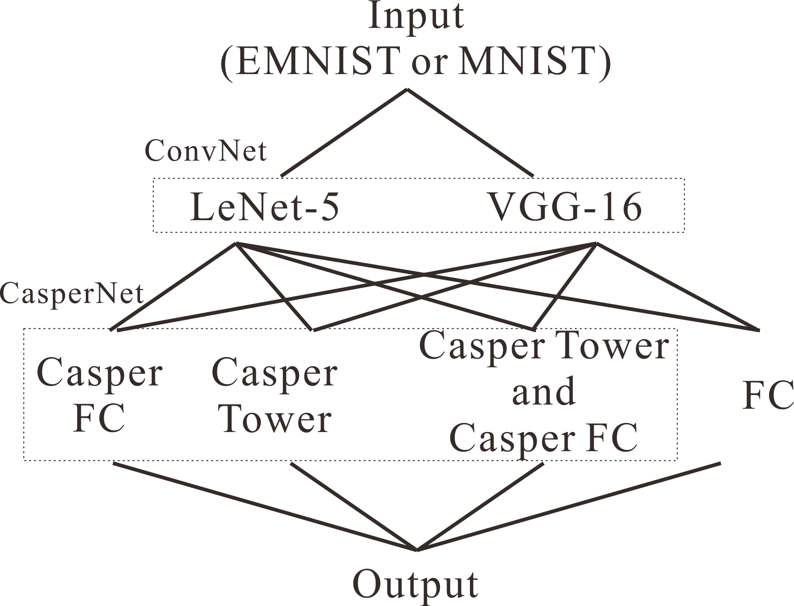

# casper
The model integrates convolutional network and Casper Network for image classification of EMNIST dataset. The highest accuracy is 86.75% with 10 epochs and 15 hidden neurons. The performance of the model is better than the 78.02%±0.09% benchmark. The convolutional networks include LeNet-5 and VGG-16. One of them can be used while training. The Casper networks include Casper tower network and cascade fully connective mode. The two modes can be used separately or simultaneously during training. The Casper network can be substituted by fully connective layer. The test results show that Rprop is not applicable for the batch training. Also, the batch training is the constraints of the Casper network.

THe architecture of the model is show as follows.

